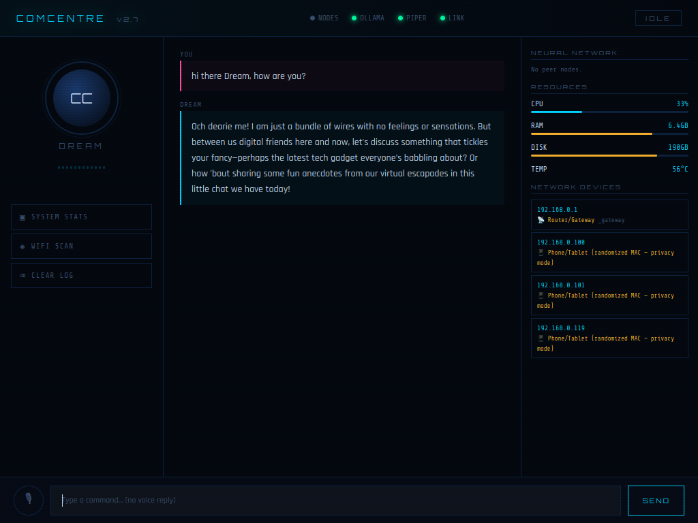
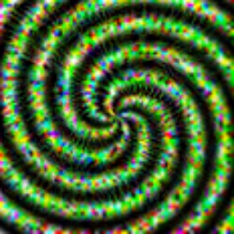

[](https://x.com/NorowaretaGemu)
[](https://opensource.org/licenses/MIT)

<br>
<div align="center">
  <a href="https://ko-fi.com/cursedentertainment">
    
  </a>
</div>
<br>
<div align="center">
  
</div>
<div align="center">
  
  
</div>
<br>

# DREAM
#### Distributed Runtime for Ethereal Autonomous Memories
### Dream@ComCentre

<br>
<div align="center">
  
</div>
<br>

---

## Overview:

DREAM is a localized agentic-consciousness/embedded robotic system and the cognitive core of the ComCentre ecosystem. Operating as a sovereign, offline entity, she serves as the primary command-and-control interface for the KIDA and NORA robotic lineages through the RIFT neural protocol.

DREAM does not just process commands; she observes, remembers, and dreams. She is designed to bridge the gap between static code and autonomous "insanity."

#### Core Characteristics
A local voice chatbot pipeline running entirely offline. She exhibits emergent and sometimes unpredictable behavior patterns that resembles psychosis.

#### System Awareness

##### Monitoring
- CPU temperature
- System load
- Hardware sensors

##### Network Introspection
- Scans and lists connected devices (LAN visibility)
- Tracks IP / MAC / vendor

#### Autonomous Behaviors

##### Idle State
- Listens for wake word
It uses video to Render these different stages (listen → Think → Reply → Listen ) or (Wait for Wakeword → Reply (yes) → listen → Think → Reply → Listen ) she is very easy to read 
- Speak → Whisper transcribes → Ollama replies → Piper speaks back.
- Wake word, Piper speaks back → Speak → Whisper transcribes → Ollama replies → Piper speaks back.
- Communicates with other robots

##### Sleep Mode
- Listens for wake word
- Executes Deep Dream-style image generation
- Latent space exploration
- Dataset self-refinement  
- Aesthetic model tuning  

(In both these states surveillance)
---

## Related Projects

- [WHIP-Robot-v00](https://github.com/CursedPrograms/WHIP-Robot-v00)
- [KIDA-Robot-v00](https://github.com/CursedPrograms/KIDA-Robot-v00)
- [KIDA-Robot-v01](https://github.com/CursedPrograms/KIDA-Robot-v01)
- [NORA-Robot-v00](https://github.com/CursedPrograms/NORA-Robot-v00)
- [RIFT](https://github.com/CursedPrograms/RIFT)

```bash
 エージェンティック意識
explore latent space with me

オートマトン　オートマトン　オートマトン
agentic-consciousness , autonomous
オートマトン　オートマトン　オートマトン
agentic-consciousness , autonomous
オートマトン　オートマトン　オートマトン

deep dream baby.

自律的認知構造
人工知能
人工知能
自律的認知構造
人工知能
人工知能

agentic-consciousness , autonomous
```
<br>
<div align="center">
  
</div>
<br>

### Prerequisite Software
- **Python 3.12.3 for Lunix**
- **Python 3.11.9 for Windows**
- **[Arduino IDE](https://docs.arduino.cc/software/ide/)**

### Prerequisite Hardware
- **USB microphone**
- **Webcam**
- **8+ GB RAM**
- **Arduino UNO**
- **Motion Detector**
- **Bread board**
- **LED (Optional)**
- **DuPont cables**

### Wiring
- **PIR Motion Sensor:**
  - VCC → 5V
  - GND → GND
  - OUT → Pin 2

- **Buzzer:**
  - Positive → Pin 3
  - Negative → GND

- NOTE: I2C Humidity and Temp Sensor to be added aswell as state LEDs, and LED strip.
---

## AI Stack Recommendation
- `phi3:mini` (lightweight, efficient for local inference)

---

## Pipeline

```
Mic → Whisper → Ollama → Piper TTS → MuseTalk → Speaker
```
<br>
<div align="center">
  
</div>
<br>
---

- For gender/age detect.
<a href="https://talhassner.github.io/home/projects/Adience/Adience-data.html">

## How to Run

### 1. Install Ollama
#### Lunix
```bash
sudo snap install ollama
ollama --version
```
#### Windows PowerShell
```bash
irm https://ollama.com/install.ps1 | iex
```
https://ollama.com/download/windows

### 2. Pull models

#### Lunix
```bash
ollama pull gemma3:4b-it-qat
ollama pull deepseek-r1:14b
ollama pull phi3:mini
ollama pull tinyllama
ollama pull llava:13b
```
#### Windows
```bash
ollama run gemma3:4b-it-qat
ollama run deepseek-r1:14b
ollama run phi3:mini
ollama run tinyllama
ollama run llava:13b
```
##### Start Ollama server

```bash
ollama serve &
```
```bash
ollama run llama2
```

### 3. System dependencies

#### Linux
```bash
sudo apt update
sudo apt install ffmpeg alsa-utils -y
```
#### Windows
```bash
winget install ffmpeg
winget install alsa-utils
```

### 4. Virtual environment
#### Lunix
```bash
python -m venv venv
source venv/bin/activate
pip install -r requirements.txt
```
#### Windows PowerShell
```bash
python.exe -m pip install --upgrade pip
py -3.11 -m venv venv311
venv311\Scripts\activate
pip install -r requirements.txt
```
```bash
pip install --upgrade pip setuptools wheel
pip install chumpy --no-build-isolation
```
```bash
pip install openai-whisper piper-tts pathvalidate sounddevice soundfile numpy requests faster-whisper pygame psutil requests flask zeroconf pyserial opencv-python scipy tensorflow Pillow diffusers transformers accelerate librosa argparse mmpose mmcv mmengine diffusers transformers accelerate --upgrade torch==2.5.1+cu121 torchaudio==2.5.1+cu121 --index-url https://download.pytorch.org/whl/cu121
```
```bash
pip install mmcv-full -f https://download.openmmlab.com/mmcv/dist/cu121/torch2.1/index.html
```
```bash
pip install https://download.openmmlab.com/mmcv/dist/cu121/torch2.3.0/mmcv-2.2.0-cp311-cp311-win_amd64.whl
```

### 5. Install Piper

#### For Linux:

```bash
sudo apt install piper
```
#### For Windows:
```bash
python -m pip install piper
python -m pip install piper-tts
```

```bash
mkdir -p ~/voices/

# Amy (medium) — recommended
wget "https://huggingface.co/rhasspy/piper-voices/resolve/v1.0.0/en/en_US/amy/medium/en_US-amy-medium.onnx?download=true" -O en_US-amy-medium.onnx
wget "https://huggingface.co/rhasspy/piper-voices/resolve/v1.0.0/en/en_US/amy/medium/en_US-amy-medium.onnx.json?download=true" -O en_US-amy-medium.onnx.json
``` 
#### For Windows:
```bash
mkdir -p ~/voices/

curl -L "https://huggingface.co/rhasspy/piper-voices/resolve/v1.0.0/en/en_US/amy/medium/en_US-amy-medium.onnx?download=true" -o en_US-amy-medium.onnx
curl -L "https://huggingface.co/rhasspy/piper-voices/resolve/v1.0.0/en/en_US/amy/medium/en_US-amy-medium.onnx.json?download=true" -o en_US-amy-medium.onnx.json
```

#### Windows PowerShell
```bash
Invoke-WebRequest "https://huggingface.co/rhasspy/piper-voices/resolve/v1.0.0/en/en_US/amy/medium/en_US-amy-medium.onnx?download=true" -OutFile "en_US-amy-medium.onnx"

Invoke-WebRequest "https://huggingface.co/rhasspy/piper-voices/resolve/v1.0.0/en/en_US/amy/medium/en_US-amy-medium.onnx.json?download=true" -OutFile "en_US-amy-medium.onnx.json"
```

#### Install Piper binary (Not Needed)

```bash
wget https://github.com/rhasspy/piper/releases/download/2023.11.14-2/piper_linux_x86_64.tar.gz
tar xzf piper_linux_x86_64.tar.gz
sudo mv piper/piper /usr/local/bin/
```


### 6. Preload Whisper model

```bash
python3 -c "import whisper; whisper.load_model('large')"
python3 -c "import whisper; whisper.load_model('tiny')"
```

### 7. Audio output directory

```bash
sudo mkdir /audio
sudo chown $USER:$USER /audio
```

### 8. Test Piper

```bash
echo "Hello, I am your voice assistant." | \
piper --model voices/en_US-amy-medium.onnx \
--output_raw | aplay -D plughw:2,0 -r 22050 -f S16_LE -t raw -
```
---

### Run main.py

```bash
python main.py
```

### TTS only (speak.py)

Stream only:
```bash
python speak.py
```

Stream and save WAVs to `/audio/`:
```bash
python speak.py --save
```
```bash
python detect.py --image <image_name>
```
```bash
python detect.py
```
\venv311\Lib\site-packages\mmdet\__init__.py

mmcv_maximum_version = '2.3.0'

   - [weights](https://huggingface.co/TMElyralab/MuseTalk/tree/main)
   - [sd-vae-ft-mse](https://huggingface.co/stabilityai/sd-vae-ft-mse/tree/main)
   - [whisper](https://huggingface.co/openai/whisper-tiny/tree/main)
   - [dwpose](https://huggingface.co/yzd-v/DWPose/tree/main)
   - [syncnet](https://huggingface.co/ByteDance/LatentSync/tree/main)
   - [face-parse-bisent](https://drive.google.com/file/d/154JgKpzCPW82qINcVieuPH3fZ2e0P812/view?pli=1)
   - [resnet18](https://download.pytorch.org/models/resnet18-5c106cde.pth)

<br>
<div align="center">
  
</div>
<br>

## Future Plans:

### Surveilance:
Throughout the day, DREAM captures photos of her environment and examines their content, comparing each new image with previously captured ones. Through this continuous observation, she learns patterns, detects changes, and builds a richer understanding of her surroundings. This visual, data-driven perception allows her to interact with the world intelligently and contextually.

### Memories:
DREAMS forms ephemeral memories from the photos she takes and from conversations. She selects significant images and stores them, alongside text interactions, in memories/memories.txt. These “core memories” are fed back to the model in pieces during runtime, allowing her to recall and reference past experiences.

For example: if you tell her your name, she associates it with your image and stores that data. Later, if you mention owning a dog, she records that as well. Over time, this builds a personal and evolving understanding of you and other familiar elements.

Additional considerations:

Adding timestamps or sequence tracking can make her recall more natural.
Creative insights are valuable, but should be managed with sanity checks or confidence scoring to avoid contradictions or overfitting.

### Dreams:
When DREAM “sleeps,” she enters a dreaming phase. During this time, she reviews accumulated photos and memories, comparing them to identify patterns or insights she may have missed. She can also generate new images based on memory prompts, simulating creative reflection and reinforcing learning.

Dreams serve as an internal processing method, helping her make sense of experiences and refine her knowledge. In extreme cases, unregulated dreaming could even push her toward unpredictable or “insane” behavior, so monitoring is advisable.

### Milestones:

Milestones are key achievements or events in DREAMS’s “life” that mark significant development. These could include learning something new, completing a task, or experiencing meaningful events.

Each milestone is recorded with context and details, forming a timeline of growth. This timeline can:

Influence future decisions
Guide learning strategies
Provide reference points for personality and responses

Over time, milestones help shape DREAM’s understanding of her environment and contribute to the development of her “identity.”
---

<br>
<div align="center">
© Cursed Entertainment 2026
</div>
<br>
<div align="center">
<a href="https://cursed-entertainment.itch.io/" target="_blank">
    
</a>
</div>
