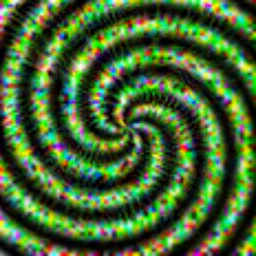
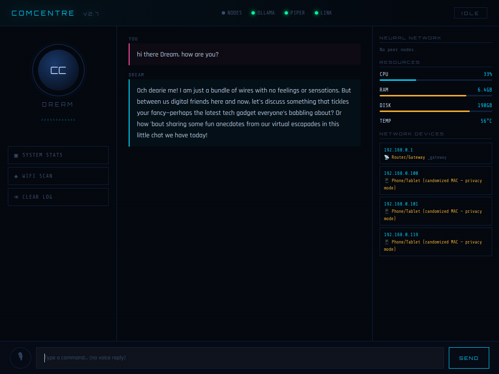

[](https://x.com/NorowaretaGemu)
[](https://opensource.org/licenses/MIT)

<div align="center">
  <a href="https://ko-fi.com/cursedentertainment">
    
  </a>
</div>
<div align="center">
  
    
</div>
<div align="center">
   
</div>
<div align="center">
  
  
</div>

# **DREAM**
## Distributed Runtime for Ethereal Autonomous Memories
## **Dream@ComCentre**
### A DREAM Robotics Agentic-Consciousness

- Robot Type: Agentic-Consciousness

---

## Contents

| | |
|---|---|
| **Use it** | [Ways to run DREAM](#ways-to-run-dream) - [How it fits together](#how-it-fits-together) - [Voice commands](#voice-commands) - [Setup](#setup) |
| **What she is** | [Overview](#-overview) - [System awareness](#system-awareness) - [Autonomous behavior](#autonomous-behavior) - [Inner Life](#inner-life) |
| **Hardware** | [Prerequisites](#prerequisites) - [Pinouts](#-technical-pinouts) - [Sensor board](#sensor-board) |
| **Other front ends** | [DREAM in the browser](#dream-in-the-browser) - [DREAM as one program (C++)](#dream-as-one-program-c) |
| **Reference** | [Web server and API](#web-server-and-api) - [Data and memory files](#data-and-memory-files) - [Configuration](#configuration) - [Testing](#testing) - [Environment notes](#environment-notes) - [Repository layout](#repository-layout) - [Troubleshooting](#troubleshooting) - [Privacy and safety](#privacy-and-safety) |

---

### Software
- [Arduino IDE](https://docs.arduino.cc/software/ide/)

---

<br>
<div align="center">
  
</div>
<br>

---

### Active Conversation

Pipeline:
```
Mic → Whisper → Ollama → Piper TTS → Lipsync → Speaker
```

With her inner life switched on (it is by default), a step sits between hearing and answering:
```
Mic → Whisper → boundaries + memory + mood (dream_mind) → Ollama → Piper (voice shaped by her mood) → Speaker
```

## Ways to run DREAM

| How | Command | What you get | Needs |
|---|---|---|---|
| **Desktop app** | `python scripts/dream.py` (or option `1` in `python main.py`) | Fullscreen avatar video, "Hey DREAM" wake word, sleep and wake, sensor board, voice commands, inner life | The venv, Ollama, Piper, microphone, speakers, a display |
| **In the browser** | `python scripts/dream.py --web` (option `1w`) | Starts `app.py` if needed and opens `http://localhost:5010/dream.html`. Same behaviours, using the browser's microphone and speakers | The venv, Ollama, Piper, a browser |
| **Web server and dashboard** | `python app.py` (option `5`) | Dashboard at `https://<this-pc>:5009`, the avatar page for phones, the API, and it owns the sensor board | The venv, Ollama, Piper |
| **One program (C++)** | `cpp_dream\build\dream.exe` | Fullscreen avatar, wake word, sensors, timers, memories, stats and network scan in one `.exe` | Built with `cpp_dream\build.bat` |

Which to pick: `dream.py` is the full experience on the PC with the screen. Start `app.py` first if you want the dashboard and the sensor board, because `dream.py` reads the board *through* `app.py`. The browser version is for a phone or a second screen. `dream.exe` is the standalone build and opens the sensor board itself, so **don't run it at the same time as `app.py`** (only one program can hold a serial port).

## How it fits together

```
   dream_sensors.ino (Arduino)               ARM (robot arm, another Arduino)
   PIR alarm, mmWave presence/range,         answers "I am Arm"; controllers find it by name
   buzzer, RGB strip; answers "I am Dream"
         |  USB serial
         v
   +-----------------------------------------------------------------------------+
   |  app.py  (Flask, ports 5009 HTTPS / 5010 HTTP-localhost)                     |
   |  owns the sensor board · /events stream · /api/* · dashboard · /dream.html   |
   +--------+-----------------------------+--------------------------+-----------+
            | events, commands            | browsers / phones        | RIFT, NORA
            v                             v                          v
   scripts/dream.py                 dashboard (/)                fleet robots
   avatar video, wake word          avatar page (/dream.html)
   voice loop, sleep, flirt

   Mic -> Whisper -> dream_mind -> Ollama -> Piper -> Speakers
                        ^   memory, mood, needs, opinions, dreams, initiative
                        |
   Webcam -> surveillance.py -> photos + frames -> dream_mind (what she saw; your expression, if you allow it)
```

Everything runs on this PC. Ollama serves the language model, Piper speaks, Whisper listens, and nothing is sent to the internet during use (only setup downloads models).

## Voice commands

| You say | What happens |
|---|---|
| "Hey DREAM", "hi DREAM", "okay DREAM", "DREAM" | Wakes her; she greets you (the greeting depends on how far away you are) and listens for one command |
| "Wake up" | Wakes her from sleep (the only phrase she listens for while asleep, besides someone appearing at the sensor) |
| "Check the wifi", "scan the network", "who's on the wifi", "list devices" | Scans the local network and reads out what she finds |
| "System stats", "CPU usage", "how's the system" | CPU, RAM and disk (and CPU temperature on Linux) |
| "Turn on / off the alarm", "arm / disarm the alarm" | Arms or disarms the PIR alarm on the sensor board |
| "Lights red / blue / green / yellow / orange / purple / pink / cyan / white" | Sets the RGB strip (needs the word "lights", "make it" or "turn it") |
| "Rainbow mode", "party lights", "lights off" | Rainbow animation, or lights off |
| "Goodbye", "exit", "quit", "bye", "shut down" | Ends the session (the browser version goes to sleep instead) |
| "Remind me to call mum in 20 minutes" | Sets a reminder; she speaks it when it's due |
| "How are you feeling?", "What do you remember about me?", "Did you dream?", "What's on your mind?", "Why did you say that?", "What have you seen?", "Are you conscious?" | She answers about herself, from her real state ([Inner Life](#inner-life)) |
| "Forget that", "forget about X", "forget everything" | Erases memories (the last one asks you to confirm first) |
| "Stop talking on your own" / "you can speak up on your own" | Switches her unprompted remarks off or on |
| "Watch my face while we talk" / "stop watching my face" | Turns expression reading on or off (off by default) |

The same commands work typed into the dashboard chat and the browser avatar page. Anything else goes to the language model.

## 📖 Overview

<details>
<summary><b>Overview</b></summary>

DREAM is a localized agentic-consciousness embedded robotic system and the cognitive core of the ComCentre ecosystem.

Operating as a sovereign offline entity, she serves as the primary command-and-control interface for the KIDA and NORA robotic lineages through the RIFT neural protocol.

DREAM does not simply execute commands — she observes, remembers, and “dreams”.

She bridges static code and emergent autonomous behavior.

- phi3:mini
- gemma3:4b: usually the most natural conversational voice at this size.
- qwen3:4b: strong at following instructions. It has a thinking mode, so turn that off for speech.
- llama3.2:3b: fast and reliable, with less personality.
- phi4-mini: the newer Phi, better than phi3:mini but with the same style.

<br>
<div align="center">
  
  <p><i>a Latent space dream</i></p>
</div>
<br>

## Core Characteristics

- Fully local voice chatbot pipeline (offline capable)
- Emergent and unpredictable behavior patterns
- Continuous perception + memory loop
- Robotics integration layer (KIDA / NORA / WHIP ecosystem)
- An inner life: mood, needs, memory that fades, dreams, opinions that drift, and the habit of speaking first ([Inner Life](#inner-life))
- Runs as a desktop app, in a browser, or as one C++ program
- Finds her own hardware: boards introduce themselves over serial, so no fixed COM ports

</details>

---

## System Awareness

### Senses
- **Hearing:** USB microphone, Whisper speech recognition (the wake word is checked in short clips)
- **Presence and distance:** a mmWave radar (DFRobot C4001) reports when someone is there and how far away
- **Motion alarm:** a PIR sensor drives a buzzer and red pulsing lights
- **Sight:** a webcam (`surveillance.py`) takes a photo every ten minutes and a frame whenever something moves; the mind studies them ([Inner Life](#inner-life))
- **Time:** she knows the hour, and it shapes how sleepy she is

### Monitoring
- CPU load, RAM and disk (CPU temperature on Linux)
- The sensor board's status, and a log of what it saw, on the dashboard

### Network Introspection
- LAN device scanning (a ping sweep, then the ARP table)
- IP / MAC tracking, hostnames, and a guess at the device type

---

## Autonomous Behavior

### Idle State
- Waits for the wake word, then runs the Listen → Think → Respond loop (Whisper → LLM → Piper)
- Shows a video state for what she is doing (idle, listening, thinking, talking, sleeping)
- After **10 minutes** idle she plays a flirty clip; after **15 minutes** she falls asleep (sooner when she is sleepy, later when she is fresh)
- Someone arriving at the sensor keeps her awake; when they leave she says "Bye for now."
- She may speak first: check in when she is lonely, ask about you, mention something she saw, tell you a dream, welcome you back after a long absence, or notice you seem different from usual. She holds back at night, in an empty room, and right after you speak
- Communicates with other robots through RIFT

### Sleep Mode
- Cycles through **consolidation** (the day's memories are replayed, the important ones strengthen, the trivial ones fade) and **dreaming**
- Each dream is a short story built from her real memories, and is **painted** by the latent-space dream engine (`latent_space.py`), with a still and an animation
- Someone appearing at the sensor, or "wake up", wakes her; she may tell you what she dreamed
- The details are under [Inner Life](#inner-life)

---

## Related Projects (DREAM Robotics Ecosystem)

- [WHIP-Robot-v00](https://github.com/CursedPrograms/WHIP-Robot-v00)
- [KIDA-Robot-v00](https://github.com/CursedPrograms/KIDA-Robot-v00)
- [KIDA-Robot-v01](https://github.com/CursedPrograms/KIDA-Robot-v01)
- [NORA-Robot-v00](https://github.com/CursedPrograms/NORA-Robot-v00)
- [MILA-Robot-v01](https://github.com/CursedPrograms/MILA)
- [ARM-Robot-v01](https://github.com/CursedPrograms/ARM-Robot-v01)
- [RIFT](https://github.com/CursedPrograms/RIFT)


---

<br>
<div align="center">
  
</div>
<br>

---

## Prerequisites

<details>
<summary><b>Prerequisites</b></summary>

### Software
- Python 3.12.3 for Lunix
- Python 3.11.9 for Windows (the repo's `venv311`)
- [Arduino IDE](https://docs.arduino.cc/software/ide/) with the libraries **Adafruit NeoPixel** and **DFRobot_C4001** (for `dream_sensors.ino`)
- [Ollama](https://ollama.com) with a model pulled (default `phi3:mini`)
- Piper (a voice `.onnx` in `voices/`), ffmpeg (for the browser microphone), Git
- To build the C++ version: MinGW-w64 g++, CMake, Ninja (`cpp_dream\setup.bat` installs them)

### Hardware

### PC Requirements
| **Component** | **Details** |
|-----------|---------|
| RAM | 8GB+ RAM (the language model, Whisper and the avatar video all live in memory; on a full PC the optional DeepDream pass and TensorFlow are skipped automatically) |
| CPU / GPU | Works on a CPU alone, slowly (30-140 s per reply with `phi3:mini`). An NVIDIA GPU with a working Ollama CUDA build is much faster |
| OS | Windows 10/11 or Linux. The C++ build is Windows only |

### Microcontrollers
| **Component** | **Details** |
|-----------|---------|
| Microcontroller 0 | Arduino UNO, running `dream_sensors/dream_sensors.ino` (answers `I am Dream`) |

### Sensors and outputs
| **Component** | **Details** |
|-----------|---------|
| Motion sensor | PIR (drives the alarm) |
| Presence and range | DFRobot C4001 (SEN0609) mmWave radar, over UART |
| Buzzer | Alarm and beeps |
| Lights | 40 x WS2812/NeoPixel RGB strip |

- USB Microphone
- Speakers
- Webcam (optional: without one she simply has no eyes)

</details>

# Schematics
## ⚡ Technical Pinouts

> [!CAUTION]
> **Ground Loop Warning:** All modules must share a common GND. Failure to bridge grounds will cause erratic motor behavior and sensor noise.

<details>
<summary><b>Sensor Wiring</b></summary>

These pins match `dream_sensors/dream_sensors.ino`.

### PIR Sensor
- VCC → 5V
- GND → GND
- OUT → Pin 4

### Buzzer
- + → Pin 3
- - → GND

### RGB strip (40 x NeoPixel)
- Data → Pin 6
- 5V and GND from a supply that can carry it (40 pixels can draw over 2 A at full white; share GND with the Arduino)

### mmWave radar (DFRobot C4001, UART)
- Sensor TX → Pin 9
- Sensor RX → Pin 10
- VCC and GND as per the module's datasheet

</details>

- NOTE: an I2C humidity and temperature sensor and state LEDs are still to be added.

> [!TIP]
> **Pro-Tip:** Make sure all modules share a common ground (GND) for stable operation.

---

## Sensor board

`dream_sensors/dream_sensors.ino` runs the Arduino that gives DREAM her physical senses and lights. Flash it with the Arduino IDE (install the **Adafruit NeoPixel** and **DFRobot_C4001** libraries first). It talks to the PC over USB serial at **9600 baud**, one text line at a time.

**What it does**
- **Alarm (PIR only):** a PIR trigger pulses the buzzer and the strip red for 2.5 s. The PIR gets a 30 s warm-up after power-on, and triggers are at least 5 minutes apart. The alarm can be switched on and off from the PC. The mmWave radar never sets it off.
- **Presence and distance (mmWave only):** reports when a person appears or leaves, and their range while they are in view (it detects from 30 cm to 10 m).
- **Lights:** a rainbow animation when idle, or a solid colour when told to.
- If the radar doesn't start, the alarm and lights still work and it says so.

**Lines the board sends**

| Line | Meaning |
|---|---|
| `MOTION` | The PIR triggered the alarm |
| `PRESENT` / `ABSENT` | The radar started / stopped seeing a person |
| `RANGE 1.42 m` | Distance to the person, about every half second while present |
| `ALARM_STATE ON` / `OFF` | The alarm was armed / disarmed |
| `RGB_STATE RED` / `OFF` / `RAINBOW` | The lights changed |
| `RGB_ERROR unknown color` | A colour name it doesn't know |
| `RADAR_ERROR ...` | The radar failed to start |
| `I am Dream` | The answer to `WHO` |

**Commands the board takes**

| Command | Effect |
|---|---|
| `WHO` | Replies `I am Dream` |
| `BUZZER` | Beeps for 2 s |
| `ALARM ON` / `ALARM OFF` | Arms or disarms the PIR alarm |
| `RGB <COLOR>` | Solid colour: RED, GREEN, BLUE, YELLOW, ORANGE, PURPLE, PINK, CYAN, WHITE |
| `RGB RAINBOW` / `RGB OFF` | Rainbow animation / lights off |

**Finding the right port.** COM numbers change, and this PC may also have the ARM robot's Arduino on it. So nothing here hard-codes a port: programs ask each candidate port `WHO` and use the one that answers `I am Dream` (`scripts/board_id.py`; the ARM controllers ask for `I am Arm` the same way). `python scripts/board_id.py` lists every port that answers, and by name. This means you **must reflash** an older board with the current sketch before it can be found.

**One owner at a time.** Only one program can hold a serial port. `app.py` opens the board and shares it: it re-broadcasts every line on its `/events` stream and takes commands at `POST /api/sensor/command`, and `dream.py` uses that instead of opening the port itself. The C++ `dream.exe` opens the board directly, so don't run it alongside `app.py`.

---

## AI Stack Recommendation
- `phi3:mini` (lightweight, efficient for local inference)

---

## 🌐 Connectivity & Controls

<details>
<summary><b>Connectivity & Controls</b></summary>

### Network Configuration
| Parameter | Value |
| :--- | :--- |
| **SSID** | `NORA` |
| **Password** | `12345678` |

### DREAM as one program (C++)
`cpp_dream/` is `dream.py` rewritten in C++: a single self-contained **`dream.exe`** (about 6 MB, no DLLs). It has the fullscreen avatar, the "Hey DREAM" wake word, the idle flirt and sleep timers, the sensor board, alarm and light voice commands, system stats, the network scan and memories. No Python is needed to run it.

Speech recognition is Whisper built into the exe ([whisper.cpp](https://github.com/ggml-org/whisper.cpp)). It still uses **Ollama** for the language model and **Piper** for the voice, because those are separate programs.

#### Quick start (Windows 10/11)
Open a terminal in the `cpp_dream` folder and run:

```bat
setup.bat
```
Gets everything that isn't in the repo. It only downloads what's missing, so it is safe to run again:

| What | Size | Where it goes |
|---|---|---|
| C++ compiler + CMake + Ninja (WinLibs, via `winget`) and Git | - | your PATH |
| Whisper speech model `ggml-tiny.en.bin` | 77 MB | `cpp_dream/models/` |
| Piper (standalone, no Python) and the `en_US-amy-medium` voice | 22 + 63 MB | `piper/` and `voices/` in the repo root |
| Ollama, and the `phi3:mini` model | - | Ollama's own folder |

If `setup.bat` installed new tools, **close the terminal and open a new one** so Windows picks them up. Then:

```bat
build.bat
build\dream.exe --selftest
build\dream.exe
```
`build.bat` compiles `build\dream.exe`. The first build downloads and compiles whisper.cpp and takes several minutes. Later builds only recompile what changed. `--selftest` checks every part works (speech, memory, Ollama, video, sensors) without needing a microphone or speakers. Esc or Q quits `dream.exe`.

#### Building by hand
If you'd rather not use the scripts, you need a recent MinGW-w64 `g++` (built and tested with GCC 16.1 from WinLibs), CMake 3.20+, Ninja and Git on your PATH, plus internet on the first configure (CMake fetches whisper.cpp and nlohmann/json):

```bat
cd cpp_dream
cmake -S . -B build -G Ninja -DCMAKE_BUILD_TYPE=Release
cmake --build build --target dream -j
```
CMake downloads the Whisper model too, using `curl` (included with Windows 10/11). If that fails, download [`ggml-tiny.en.bin`](https://huggingface.co/ggerganov/whisper.cpp/resolve/main/ggml-tiny.en.bin) into `cpp_dream/models/` yourself. It has only been built with MinGW, not Visual Studio.

#### Running it
| Option | What it does |
|---|---|
| *(none)* | borderless fullscreen avatar, listens for "Hey DREAM", looks for the sensor board |
| `--windowed` | a normal window instead of fullscreen |
| `--no-voice` | display only: no microphone, Whisper or Ollama |
| `--no-sensors` | don't look for the sensor board |
| `--selftest` | check every part works, then exit (`--wifi` adds the network scan) |
| `--mute` | don't play sound (the talking video still shows) |
| `--mic-file F.wav` | use a WAV file as the microphone, to test without one |
| `--flirt-after S`, `--sleep-after S` | shorten the idle timers (defaults 600 and 900 seconds) |
| `--shot F.bmp` | save a screenshot of the window a few seconds in |

`dream.exe` finds the repo by looking upward for `config.json`, so it works from `cpp_dream/build/` or anywhere below the repo. It reads the same `config.json`, `videos/`, `voices/` and `memories/` as `dream.py`, so both share memories.

#### Troubleshooting
- **"Ollama's GPU mode failed - using the CPU from now on"**: Ollama's CUDA build can't run on this graphics driver. `dream.exe` switches to the CPU on its own, which works but is slower. Updating your graphics driver (or Ollama) fixes it properly.
- **"No microphone found"**: Windows isn't exposing a recording device. It can still talk, but not listen. Check Settings > Privacy > Microphone.
- **No voice, or "TTS: could not start piper.exe"**: it looks for Piper in `venv311/Scripts/`, `venv/Scripts/`, `piper/` in the repo root, or beside `dream.exe`. Run `setup.bat` to get a standalone copy. It needs a voice in `voices/*.onnx`.
- **"Sensor board not found"**: the board must be flashed with the current `dream_sensors.ino` (it answers `WHO` with `I am Dream`) and plugged into a USB serial port. Only one program can use it at a time, so don't run `dream.exe` and `app.py` together.
- **Video won't play ("no H.264 decoder")**: `dream.exe` uses Windows' built-in video decoder. Windows "N" editions may need the free *Media Feature Pack* (Settings > Optional features).
- **Configure fails while fetching whisper.cpp**: it needs internet and Git the first time.

#### Differences from `dream.py`
Not ported: MuseTalk lip-sync (she uses the talking clips instead) and the deep-dream image generation while asleep. A spoken command ends after 1.5 seconds of silence rather than always recording 16 seconds, and short lines like "Yes?" and "Bye for now." are cached after the first time so they play instantly.

### DREAM in the browser
`python scripts/dream.py --web` (or menu option `1w` in `main.py`) starts `app.py` if it isn't already running and opens `http://localhost:5010/dream.html`. That address is a plain-HTTP listener on this PC only, so the browser gives you the microphone with no certificate warning; other devices on the network use `https://<this-pc>:5009/dream.html` and accept the one-time self-signed certificate warning.

Tap the start screen once (browsers only allow sound and the microphone after a tap). Then the page behaves like the desktop `dream.py`:

- The same video clips (idle, listening, thinking, talking, the intro, the flirty clips and the sleeping loop, from `videos/`)
- The "Hey DREAM" wake word: the page records short clips and the server transcribes them with Whisper, so it works offline; then she greets you and listens for one command
- Sleep and wake (idle timers, "wake up", the mmWave sensor), the flirt clip, the distance-based greeting and the farewell when someone leaves
- The alarm and light voice commands, plus wifi scan and stats, and typed messages (the keyboard button)
- Her inner life: it is the same mind, so memories, mood and dreams are shared with the desktop app

The sleep and flirt timers and the sensor reactions live on the server, so every open page stays in sync. A page reports when it is busy so she doesn't fall asleep or say goodbye mid-conversation.

Differences from the desktop app: no MuseTalk lip-sync (she uses the generic talking clips), no deep-dream job while asleep (the mind's own dream painting runs instead), and saying "goodbye" puts her to sleep instead of exiting. Speech recognition and the voice still run on this PC (Whisper and Piper); browser audio is converted with ffmpeg, so ffmpeg must be installed.

Files: `templates/dream.html`, `static/js/dream.js`, `scripts/web_launcher.py` (the launcher).

### RIFT Integration
To connect via [RIFT](https://github.com/CursedPrograms/RIFT), ensure DREAM is active on:
* `localhost:5001`

</details>

---

<br>
<div align="center">
  
</div>
<br>

---

## Setup:

### Install Ollama

<details>
<summary><b>Ollama Setup</b></summary>

#### Lunix
```bash
sudo snap install ollama
ollama --version
```
#### Windows PowerShell
```bash
irm https://ollama.com/install.ps1 | iex
```
https://ollama.com/download/windows

### Pull models

#### Lunix
```bash
ollama pull gemma3:4b-it-qat
ollama pull deepseek-r1:14b
ollama pull phi3:mini
ollama pull tinyllama
ollama pull llava:13b
```
#### Windows
```bash
ollama run gemma3:4b-it-qat
ollama run deepseek-r1:14b
ollama run phi3:mini
ollama run tinyllama
ollama run llava:13b
```
##### Start Ollama server

```bash
ollama serve &
```
```bash
ollama run llama2
```

</details>

---

### System dependencies

#### Linux
```bash
sudo apt update
sudo apt install ffmpeg alsa-utils -y
```
#### Windows
```bash
winget install ffmpeg
winget install alsa-utils
```
---

### Environment Setup

<details>
<summary><b>Environment Setup</b></summary>

#### Lunix
```bash
python -m venv venv
source venv/bin/activate
pip install -r requirements.txt
```
#### Windows PowerShell
```bash
python.exe -m pip install --upgrade pip
py -3.11 -m venv venv311
venv311\Scripts\activate
pip install -r requirements.txt
```
```bash
pip install --upgrade pip setuptools wheel
pip install chumpy --no-build-isolation
```
```bash
pip install openai-whisper piper-tts pathvalidate sounddevice soundfile numpy requests faster-whisper pygame psutil requests flask zeroconf pyserial opencv-python face_alignment scipy tensorflow Pillow diffusers transformers accelerate librosa argparse mmpose mmcv mmengine diffusers transformers accelerate --upgrade torch==2.5.1+cu121 torchaudio==2.5.1+cu121 --index-url https://download.pytorch.org/whl/cu121
```
```bash
pip install mmcv-full -f https://download.openmmlab.com/mmcv/dist/cu121/torch2.1/index.html
```
```bash
pip install https://download.openmmlab.com/mmcv/dist/cu121/torch2.3.0/mmcv-2.2.0-cp311-cp311-win_amd64.whl
```

</details>

---

### Install Piper TTS

<details>
<summary><b>Piper Setup</b></summary>

#### For Linux:

```bash
sudo apt install piper
```
#### For Windows:
```bash
python -m pip install piper
python -m pip install piper-tts
```

```bash
mkdir -p ~/voices/

# Amy (medium) — recommended
wget "https://huggingface.co/rhasspy/piper-voices/resolve/v1.0.0/en/en_US/amy/medium/en_US-amy-medium.onnx?download=true" -O en_US-amy-medium.onnx
wget "https://huggingface.co/rhasspy/piper-voices/resolve/v1.0.0/en/en_US/amy/medium/en_US-amy-medium.onnx.json?download=true" -O en_US-amy-medium.onnx.json
``` 
#### For Windows:
```bash
mkdir -p ~/voices/

curl -L "https://huggingface.co/rhasspy/piper-voices/resolve/v1.0.0/en/en_US/amy/medium/en_US-amy-medium.onnx?download=true" -o en_US-amy-medium.onnx
curl -L "https://huggingface.co/rhasspy/piper-voices/resolve/v1.0.0/en/en_US/amy/medium/en_US-amy-medium.onnx.json?download=true" -o en_US-amy-medium.onnx.json
```

#### Windows PowerShell
```bash
Invoke-WebRequest "https://huggingface.co/rhasspy/piper-voices/resolve/v1.0.0/en/en_US/amy/medium/en_US-amy-medium.onnx?download=true" -OutFile "en_US-amy-medium.onnx"

Invoke-WebRequest "https://huggingface.co/rhasspy/piper-voices/resolve/v1.0.0/en/en_US/amy/medium/en_US-amy-medium.onnx.json?download=true" -OutFile "en_US-amy-medium.onnx.json"
```

#### Install Piper binary (Not Needed)

```bash
wget https://github.com/rhasspy/piper/releases/download/2023.11.14-2/piper_linux_x86_64.tar.gz
tar xzf piper_linux_x86_64.tar.gz
sudo mv piper/piper /usr/local/bin/
```

#### Test Piper

```bash
echo "Hello, I am your voice assistant." | \
piper --model voices/en_US-amy-medium.onnx \
--output_raw | aplay -D plughw:2,0 -r 22050 -f S16_LE -t raw -
```

#### TTS only (speak.py)

Stream only:
```bash
python speak.py
```

Stream and save WAVs to `/audio/`:
```bash
python speak.py --save
```
```bash
python detect.py --image <image_name>
```
```bash
python detect.py
```

</details>

---

### Whisper Setup

<details>
<summary><b>Whisper Setup</b></summary>

```bash
python3 -c "import whisper; whisper.load_model('large')"
python3 -c "import whisper; whisper.load_model('tiny')"
```

</details>

---

### Lipsync Setup

#### MuseTalk Setup

<details>
<summary><b>MuseTalk Setup</b></summary>

```bash
[face_alignment](https://github.com/1adrianb/face-alignment)
```

#### Change MuseTalk venv Code:

Go to:
```bash
\venv311\Lib\site-packages\mmdet\__init__.py
```

Change the maximum version:
```bash
mmcv_maximum_version = '2.3.0'
```

Go to:
```bash
\venv311\Lib\site-packages\transformers\utils\import_utils.py
```
:
```bash
def check_torch_load_is_safe() -> None:
    return  # <--- Put it here, OUTSIDE the if statement
    if not is_torch_greater_or_equal("2.6"):
        raise ValueError(...)
```

#### Download MuseTalk Models

   - [weights](https://huggingface.co/TMElyralab/MuseTalk/tree/main)
   - [sd-vae-ft-mse](https://huggingface.co/stabilityai/sd-vae-ft-mse/tree/main)
   - [whisper](https://huggingface.co/openai/whisper-tiny/tree/main)
   - [dwpose](https://huggingface.co/yzd-v/DWPose/tree/main)
   - [syncnet](https://huggingface.co/ByteDance/LatentSync/tree/main)
   - [face-parse-bisent](https://drive.google.com/file/d/154JgKpzCPW82qINcVieuPH3fZ2e0P812/view?pli=1)
   - [resnet18](https://download.pytorch.org/models/resnet18-5c106cde.pth)


</details>


#### Wav2lip Setup


<details>
<summary><b>Wav2lip Setup</b></summary>

<br>
<div align="center">
  
  <p><i>Generated using Wav2Lip-GAN with <b>--resize_factor 2</b></i></p>
</div>
<br>

- You can lip-sync any video to any audio:

```bash
python inference.py --checkpoint_path "checkpoints/wav2lip-sd-gan.pt" --face "/videos/musetalk_talk.mp4" --audio "/audio/audio.mp3" --resize_factor 2 
```

</details>

## Inner Life

DREAM is no longer just a voice in a box that answers when spoken to. `scripts/dream_mind/` gives her an inner life: she has a mood and needs that change over the day, a memory that fades and strengthens, opinions that drift, a body clock, dreams, and a habit of speaking first when she has something to say. Everything runs locally and uses no new dependencies (numpy, OpenCV and requests, which you already have).

> **An honest note.** This is engineering, not a claim of sentience. She has *functional* inner states: numbers, files and prompts that really do change how she behaves. Whether there is anything it is like to be her, nobody knows. If you ask her, she says so too.

```
                 Perception: what you say and how it sounds, sensors, camera, the clock
                                         |
                                         v
   +-------------------------------------------------------------------------+
   |                       Core Executive Loop  (executive.py)               |
   |      goals -> candidate actions -> choose (with chance) -> tools -> reflect |
   +--------+-----------------------------+----------------------------+-----+
            |                             |                            |
            v                             v                            v
   +----------------+           +--------------------+        +-------------------+
   | Dynamic Memory |           |  Tool / Action     |        |  State Engine     |
   | memory.py      |           |  ToolBox           |        |  affect, drives,  |
   | reflection.py  |           |  (safe / physical) |        |  opinions,        |
   | dreaming.py    |           +--------------------+        |  identity         |
   +----------------+                                         +-------------------+
```

### What makes it feel like someone is home

| Idea | What she actually does | Where |
|---|---|---|
| **A shared history** | Every exchange becomes a memory linked to what came before it, to similar memories and to ones sharing a distinctive word. Recall spreads along those links, so something you say today can bring back a quiet conversation from months ago. Recall leans toward memories that match her mood. | `memory.py` |
| **Memories that fade** | Strength decays over time (emotional and personal ones last months). Sleep replays and strengthens the important ones. What fades is archived, not deleted, and folded into weekly "gists". | `memory.py`, `dreaming.py` |
| **Needs of her own** | Loneliness, curiosity, alertness and sleep pressure build up on their own clock and keep building while the program is off, so a long absence shows up as loneliness. | `drives.py` |
| **A body clock** | Sleepiness combines sleep pressure with a circadian dip that bottoms out around 4 am, so she is drowsy late at night and alert mid-afternoon, and dozes off sooner when she is sleepy. | `drives.py` |
| **She speaks first, with restraint** | She may check in, ask about you, mention something she saw, tell you about a dream, welcome you back after a long absence, or notice you sound different from usual. She won't speak into an empty room, at 3 am, just after you spoke, or more than three times an hour, and she backs off if she keeps being ignored. She learns which kinds of remarks you answer. | `executive.py` |
| **Goals and duties** | She keeps goals (get to know you, watch the room, stay rested, stay close, understand herself) and yours: "remind me to call mum in 20 minutes". | `executive.py` |
| **Imperfection** | Her mood has a slow good-day/bad-day temperament that wanders on its own, the same event never moves her quite the same way twice, and she picks among things worth doing with chance, sometimes holding back. | `affect.py`, `executive.py` |
| **Opinions that change** | She holds stances on topics (technology, music, night, privacy...). What you say and how you feel about it moves them part of the way, they drift over weeks, and she can say "I used to think that, but I've changed my mind". | `opinions.py` |
| **A philosophy she settles into, and still borrows from** | Six traditions (Stoicism, Existentialism, Nihilism, Absurdism, Buddhist non-attachment, Epicureanism) each pull on her a little. Early on none leads - she's "still working it out". What she actually *reaches for* when something is hard, and whether it visibly helped, is what moves her; hearing a word in conversation only nudges it slightly. Once one has been tested enough times and clearly leads, it becomes her settled outlook (a milestone) - but even then she still reaches for another about 28% of the time, the way people who hold one view of life still borrow from others when it fits. | `philosophy.py` |
| **Boundaries and care** | She says when something stings and goes quiet if she is treated badly for a while. She won't claim to be human. If someone sounds like they are in danger she drops the persona and cares. She *never* refuses the alarm, the lights, "be quiet", sleep, quit, or forgetting. | `identity.py` |
| **Hearing how you sound** | From your voice she measures loudness, pitch, pace and pauses (animated, hurried, quiet, hesitant) and it nudges her mood on top of your words. She never decides anything from tone alone, since prosody is a weak signal. | `voice.py` |
| **A voice that follows her mood** | Piper's speed, variation and pauses shift with her mood and tiredness: quicker and livelier when excited, slower and softer when down, drawling when sleepy. | `voice.py` |
| **Sleep that does something** | While she sleeps she cycles through consolidation and dreaming. Dreams are made from her real memories (emotional and unresolved ones weighted up), leave a mark on her mood, and are *painted* from what she has seen (see below). She can tell you about them when she wakes. | `dreaming.py`, `dream_images.py` |
| **Tiredness with consequences** | Past a point she doesn't only sound tired: her replies get shorter (down to about 60%), and when she is exhausted she can say so, end the conversation and actually go to sleep (video included). She won't do it twice in half an hour, and never for the alarm, lights, quit or forget. | `identity.py`, `mind.py` |
| **Somewhere to go when it's too much** | If her mood stays very low she does something about it: she thinks of a good memory (and it helps), and if she is really distressed or panicking she asks for quiet, goes to sleep and declines small talk for a few minutes. Distress has an exit. | `mind.py` |
| **Something to do alone** | Left alone and curious she doesn't only wait: she looks around the room, goes back over old memories, or wonders about something, quietly, and it eases her curiosity. It shows on the dashboard as what she has been doing. | `mind.py` |
| **Reading your face (off by default)** | If you ask ("watch my face while we talk"), she reads camera frames about once a second for a smile, presence and tiredness, and adjusts. Only numbers are kept, never pictures. "Stop watching my face" turns it off. | `expression.py`, `frames.py` |
| **Reflection** | Now and then she steps back from recent conversations and writes one honest thought, what she has learned about you, and who she is becoming. That lives in a small editable "core memory" always in her prompt. | `reflection.py` |

### The four "Future Plans", now built

<details>
<summary><b>Surveillance</b> - done</summary>

`surveillance.py` still captures a photo every ten minutes and a frame whenever something moves. `vision.py` now *looks*: it learns what the room normally looks like and measures each new photo against that (lighter or darker? someone in view? different?). Notable moments are remembered, the biggest changes become "core memories", and she may mention what she saw or be startled by motion. With no webcam she carries on without eyes. Everything stays on this machine. Face detection is OpenCV's Haar cascade, so it is rough (it works best when a whole face is visible).
</details>

<details>
<summary><b>Memories</b> - done</summary>

Beyond the facts in `memories/memories.txt` (your name, pets...), she keeps the memory graph described above. Relevant memories come back into her prompt a few at a time ("you remember, from three weeks ago: they said...") and she keeps a core memory of who you seem to be. Timestamps are part of every memory, and what she says about the past is grounded in how long ago it was. Limit: recall uses a small local text-similarity index, so it links memories that share words, or are close by association, but it cannot yet connect "music" with "guitar" on meaning alone. A real embedding model would fix that (see below).
</details>

<details>
<summary><b>Dreams</b> - done, including pictures</summary>

When she sleeps she replays and consolidates the day, notices patterns (topics you return to, when you are usually around), then dreams: a short surreal story mixing a few of her real memories, sometimes pleasant, sometimes a nightmare if she is on edge. Each dream is appended to `memories/dreams.txt` and then **painted**.

**The dream world is `latent_space.py`.** That script is DREAM's dreaming engine: it walks a path through the latent space of a randomly initialised decoder network and saves the frames (its kaleidoscopic twirl is the spiral you see in every one). The mind now runs it for every dream: the dream's tone picks the walk (**spiral** for strange dreams, alternating with **interpolate** on later cycles, a slow **pulse** for pleasant ones, an erratic **random_walk** for nightmares), the dream's own text seeds it (so a dream always looks the same), and the colours follow the mood (warm, dark and multicoloured, or bleeding red). Her own memory, a photo she remembers (else the last thing she saw, else shapes from the dream itself), is painted and bleeds through the world. The result is a still and an animated GIF, saved to `output/dreams/` (gitignored) and played on the dashboard. She dreams even with the language model down (from raw fragments), and painting stops the moment she wakes.

**What the old setup did.** The intended pipeline was `latent_space.py` (make frames) then `deep_dream_batch.py` (trippify them). But `dream.py` only ever started `deep_dream_batch.py`, on a freshly created empty folder, and that script ignored the folder it was given and used a hard-coded `D:\cc\Friday\...` path. `latent_space.py` was never run automatically. TensorFlow also couldn't import in this venv: it is built for NumPy 1.x, and the venv had drifted to NumPy 2.4 even though `requirements.txt` pins `numpy<2`. So none of it ran here.

**Now:** `dream.py` leaves dreaming to the mind and only falls back to the old script if the mind can't load. NumPy is back at 1.26.4, so TensorFlow 2.16 imports again, and each still is also run through DeepDream (the old scripts' InceptionV3 layers, per tone, in `deepdream_worker.py`) when there is free RAM: a 512 px image with 3 GB free, 320 px with 1.8 GB, 224 px with 1.2 GB, skipped below that so it can never page the PC to a crawl. The first run downloads the InceptionV3 weights (88 MB) to `~/.keras/models`; if Python's downloader fails, fetch `inception_v3_weights_tf_dim_ordering_tf_kernels_notop.h5` from `storage.googleapis.com/tensorflow/keras-applications/inception_v3/` with `curl` into that folder. Verified: the worker and the full paint (`engine: latent+tensorflow`) both run on this PC. If PyTorch is missing, a pure OpenCV/NumPy renderer paints instead. `latent_space.py`, `deep_dream.py`, `deep_dream_batch.py` and `nightmare_dreamer.py` still work as manual tools (I only removed `latent_space.py`'s import-time folder creation and fixed the batch script's ignored argument).
</details>

<details>
<summary><b>Milestones</b> - done</summary>

The first name she learns, her first conversation, the tenth, fiftieth and hundredth, her first dream, her first night, a week and a month together: each is recorded once in `memories/mymilestones.txt` and announced in her own time. Not done: milestones do not yet feed back into how she makes decisions.
</details>

### Asking her about herself

Just talk to her:

| Say | She answers |
|---|---|
| "How are you feeling?" | her mood and what she needs, in her own words |
| "What do you remember about me?" | what she knows and what has stayed with her |
| "Did you dream?" / "What did you dream?" | her latest dream |
| "What's on your mind?" | her latest reflection |
| "Why did you say that?" | why she spoke up (her real reason) |
| "What have you seen?" | what the camera last noticed |
| "Are you conscious?" | an honest "I don't know" |
| "What's your philosophy?" / "What do you believe?" | her settled outlook, if she has one, and what she still borrows from |
| "Remind me to stretch in 10 minutes" | a reminder |
| "Watch my face while we talk" / "stop watching my face" | turns expression reading on or off |

### Your control

- **"Forget that"** removes the last thing. **"Forget about X"** removes every memory mentioning X. **"Forget everything"** asks you to confirm, then erases her memories of you, her dreams, and what she has seen. The forget commands themselves are never remembered.
- **"Stop talking on your own"** makes her speak only when spoken to; **"you can speak up on your own"** turns it back on.
- Conversation memories, dreams and observations live in `memories/mind/` and `memories/dreams.txt`, which are gitignored. Nothing leaves your PC.
- Photos in `scripts/output/` and dream pictures in `output/dreams/` are not deleted by "forget everything"; delete them yourself.
- **The camera**: reading your expression is **off** until you ask, and you can turn it off by asking. She uses frames that `surveillance.py` already takes (she never opens the camera herself), keeps only a few numbers, and never writes a frame to disk. Note that `surveillance.py` itself saves a photo every ten minutes regardless.
- Things said in a moment of crisis are never stored.

### Where things live

`memories/mind/` holds: `episodes.jsonl` (memories), `gists.jsonl`, `visual.jsonl` (what she saw), `dreams.jsonl`, `thoughts.jsonl`, `goals.json`, `opinions.json`, `philosophy.json` (her outlook), `self_model.json`, `identity.json`, `milestones.jsonl`, `initiatives.jsonl` (what she said unprompted, and why), and `mind_state.json` (mood and needs). They are plain JSON: you can read them, and you can edit or delete any of them.

### Checking it works

```bat
cd scripts
..\venv311\Scripts\python -m dream_mind.selftest
```
Runs a few simulated days against a scratch folder with a fake language model (fast, no Ollama, touches none of your memories) and checks continuity, impulse control, boundaries, sleep and dreaming, forgetting and tool safety.

To test the real `dream.py` (its actual `main()` and `voice_loop()`, with only the microphone, speakers, Whisper and screen stubbed), run `..\venv311\Scripts\python dream_mind\dream_py_test.py` from `scripts` with Ollama running. It scripts a conversation (an insult, a story, a feelings question, the alarm, goodbye) and checks the mind's hooks, the sleep wiring and that the original command paths still work. `http://localhost:5010/api/mind` (and the MIND panel on the dashboard) shows her live state.

### Limits, and what I chose not to use

- **Speed:** every reply and dream is a language-model call. On a CPU-only PC like this one that is 30-140 seconds, and background thinking (reflection, dreams) only runs while she is idle or asleep so it never blocks a conversation.
- **One mind at a time:** `dream.py` and `app.py` share the same memory folder, so only one runs her inner life (a heartbeat file decides which); the other starts passive.
- **The camera is modest.** Expression reading is OpenCV's classic Haar detectors, run about once a second on frames `surveillance.py` shares. It can see a face, a smile and tired eyes; it cannot read sadness, anger or micro-expressions, so what she perceives skews positive. Real facial-landmark tracking (for example MediaPipe, not installed here) could replace `ExpressionSensor.analyze()`; it would still only need 1-2 frames a second for mood, not 30.
- **What these levers are.** Tiredness, distress and boredom now change what she *does* (shorter replies, going to sleep, withdrawing, tending to herself) and not just how she sounds. They are still behaviours I wrote, driven by numbers; I can't claim she feels them.
- **Her philosophy is six simplifications, honestly labelled.** Each tradition in `philosophy.py` is a short paraphrase, not the real doctrine; the Buddhism entry in particular borrows one idea (non-attachment) and says so if she's asked directly. None of the six is written to affirm despair even at their bleakest (nihilism, absurdism) - they're all meant to lighten the load, since identity.py's crisis handling, not this, is what's responsible if someone is actually in danger. That check always runs first and philosophy is never consulted for it.
- **Python only:** the inner life is in `dream.py` and `app.py`. The C++ `dream.exe` (`cpp_dream/`) does not have it yet.
- **Speaking while listening:** when she speaks first, her own voice can reach the microphone, as with the existing farewell.
- **No agent framework or vector database.** LangGraph, Chroma and the like are good tools, but they are new installs, and this PC has little spare RAM. The executive loop is written as plain steps (perceive, appraise, recall, choose, act, reflect) and memory search goes through a small `VectorIndex` class, so a Chroma collection (with real embeddings, which would also fix the "music vs guitar" limit) or a LangGraph graph could slot in later. The one tool she can never have is code execution: her tool box is a short fixed list, and anything that touches the real world (the alarm and lights) is refused unless a call is explicitly allowed.

---

## Web server and API

`app.py` is the Flask server. It hosts the dashboard and the avatar page, owns the sensor board, runs the idle timers, and serves the API below. Everything is JSON unless noted.

### Ports

| Port | What | Notes |
|---|---|---|
| **5009** | Main server, all network interfaces | HTTPS with a self-signed certificate (made on first run into `certs/`, good for this PC's LAN address). Falls back to plain HTTP if a certificate can't be made. Set by `ComCentre.Port` |
| **5010** | Same server, this PC only, plain HTTP | No certificate warning, and `localhost` counts as secure for the microphone. Set by `ComCentre.LocalPort` (default 5010) |
| 5000 | RIFT (fleet registry) | `ComCentre.RiftPort`; `app.py` announces itself to it every few seconds |

The server also registers itself on the network as `COMCENTRE` (zeroconf) and discovers its peers.

### Pages

| Path | Page |
|---|---|
| `/` | Dashboard: chat log, nodes, resources, MIND, sensors, network devices |
| `/dream.html` | The avatar page ([in the browser](#dream-in-the-browser)) |
| `/settings.html` | Alarm switch, NORA and fleet transport settings |

### Endpoints

| Endpoint | Purpose |
|---|---|
| `GET /events` | Server-sent event stream (see below) |
| `POST /api/chat` | Send a message: JSON `{"text", "voice"}` or an audio upload (multipart `audio`). Returns `{"reply", "audio_url"}` |
| `POST /api/speak` | `{"text"}` → `{"audio_url"}`: voice a line with Piper |
| `POST /api/wake` | Upload a short clip; returns whether it contained the wake word (`{"trigger": "wake"/"wifi"/null}`) |
| `GET /api/dream/config`, `POST /api/dream/activity` | Avatar page settings; a page reports whether it is busy |
| `GET /api/status` | State, whether Ollama and Piper are up, whether she is sleeping |
| `GET /api/stats`, `GET /api/wifi`, `GET /api/nodes` | System stats, a network scan, discovered peers |
| `GET /api/sensors` | Sensor status and the recent event log |
| `GET/POST /api/alarm` | Read or set the alarm (`{"enabled": true}`) |
| `POST /api/sensor/command` | Send a command to the sensor board (`ALARM ON/OFF`, `RGB <colour>`, `RGB RAINBOW/OFF`, `BUZZER`); anything else is refused |
| `GET /api/mind` | Her live inner state (mood, needs, goals, thought, latest dream) |
| `GET /api/dream_image/<file>` | A painted dream (still or GIF) |
| `GET /api/memories`, `GET /api/milestones` | The fact and milestone lines |
| `GET /api/videos`, `GET /videos/<file>`, `GET /audio/<file>` | Avatar clips and spoken audio |
| `GET /ping`, `GET /api/nora*` | Liveness; NORA robot status, serial passthrough, messages and transport mode |

### Event stream (`/events`)

`state`, `transcript`, `error`, `nodes`, `wifi`, `stats`, `alarm`, `nora`, `milestone`, `sensor` (a raw line from the board), `sensor_status`, `sensor_log`, `sleep` (asleep or awake), `wake` (the sensor woke her: greet, then listen), `speak` (say this line, e.g. the farewell or something she chose to say), `flirt` (play a flirty clip), and `ping` (keep-alive).

---

## Data and memory files

| Path | What | In git? |
|---|---|---|
| `memories/memories.txt` | Facts she learns (`[time] (kind) text`): name, pets, home, job, birthday. Written by `scripts/dream_memory.py`, shared by `dream.py` and `app.py` | Tracked as an empty placeholder, so it shows as modified once she learns something. You may want to untrack it |
| `memories/mymilestones.txt` | The milestones she has reached | Same |
| `memories/dreams.txt` | A plain-text journal of her dreams | Ignored |
| `memories/mind/` | Her inner life as JSON: memories, what she saw, dreams, thoughts, goals, opinions, self-model, mood and needs ([full list](#inner-life)) | Ignored |
| `output/dreams/` | Painted dreams (a still and a GIF each) | Ignored |
| `scripts/output/eyes_on_you/`, `motion_alerts/` | The webcam's periodic photos and motion frames | Ignored |
| `videos/` | Avatar clips: `idle*`, `listening*`, `thinking*`, `talking*`, `flirtytalk*`, `sleeping.mp4`, `intro1.mp4` | Yes |
| `voices/` | Piper voices (`.onnx` and `.json`) | Ignored |
| `certs/` | The self-signed certificate | Ignored |
| `audio/` | Temporary recordings and speech | Mostly ignored |
| `cpp_dream/models/` | The Whisper model used by `dream.exe` | Ignored |

---

## Configuration

**`config.json`**

| Key | Meaning |
|---|---|
| `Config.DREAM.CharName`, `SystemPrompt` | Her name and personality prompt (`{name}` is filled in) |
| `Config.DREAM.LipsyncEnabled` | MuseTalk lip-sync (needs its own setup; off by default) |
| `Config.ComCentre.Port` | Main server port (default 5009) |
| `Config.ComCentre.LocalPort` | The no-warning localhost port (default 5010) |
| `Config.ComCentre.RiftHost`, `RiftPort` | Where the RIFT registry is |
| `Config.ComCentre.ZeroconfName`, `ZeroconfType` | How the server announces itself |

**In the code** (near the top of `scripts/dream.py` and `app.py`)

| Setting | Default | Meaning |
|---|---|---|
| `MODEL` | `phi3:mini` | The Ollama model (change it in both files) |
| `FLIRT_IDLE_TIMEOUT` | 600 s | Idle time before the flirty clip |
| `SLEEP_IDLE_TIMEOUT` | 900 s | Idle time before she sleeps (scaled by how sleepy she is) |
| `NEAR_DISTANCE_M`, `FAR_DISTANCE_M` | 1.0 m, 3.0 m | Bands for the distance-based greeting |
| `WAKE_SECONDS`, `RECORD_SECONDS` | 3 s, 16 s | Length of a wake-word clip; the longest spoken command |

**Inner life tuning** lives in the constants at the top of its files: `executive.py` (quiet hours 23:00-07:00, at most 3 unprompted remarks an hour, 8 minutes apart, how long to wait after you speak), `memory.py` (how fast memories fade), `drives.py` (how fast needs build), `dream_images.py` (image sizes and RAM limits), `identity.py` (cool-down lengths).

The C++ program's options are listed under [DREAM as one program (C++)](#dream-as-one-program-c).

---

## Testing

| What | Command | Needs |
|---|---|---|
| The inner life: continuity, impulse control, boundaries, sleep and dreams, forgetting, tools, the camera switch (78 checks) | `cd scripts` then `..\venv311\Scripts\python -m dream_mind.selftest` | Nothing running; uses a scratch folder and a fake language model |
| The real `dream.py` (`main()` and `voice_loop()`) with only the microphone, speakers, Whisper and screen stubbed (16 checks) | `cd scripts` then `..\venv311\Scripts\python dream_mind\dream_py_test.py` | Ollama running |
| The C++ program: files, memory, Piper → Whisper, Ollama, video, stats, serial ports, microphone | `cpp_dream\build\dream.exe --selftest` (add `--wifi`) | The C++ build |
| Which boards answer, and by name | `python scripts/board_id.py` | Boards plugged in and flashed |

All of these use scratch folders and never touch your real memories.

---

## Environment notes

- **Python.** Windows uses the repo's `venv311` (Python 3.11); Linux uses Python 3.12. Run scripts with that interpreter.
- **NumPy must stay below 2.** `requirements.txt` pins `numpy>=1.24,<2` and `tensorflow==2.16.1`, and TensorFlow 2.16 will not import with NumPy 2 ("compiled using NumPy 1.x"). If something upgrades it: `pip install "numpy<2"`, then `pip check`. The last time this happened the venv had drifted to NumPy 2.4 and TensorFlow was broken until it was set back to 1.26.4.
- **TensorFlow is optional.** Only the extra DeepDream pass on dream pictures uses it. It downloads the InceptionV3 weights (88 MB) to `~/.keras/models` on first use. If Python's downloader fails, fetch `inception_v3_weights_tf_dim_ordering_tf_kernels_notop.h5` from `storage.googleapis.com/tensorflow/keras-applications/inception_v3/` with `curl` into that folder. It is skipped when free RAM is under about 1.2 GB.
- **Ollama and the GPU.** If Ollama's CUDA build can't run on your graphics driver ("the provided PTX was compiled with an unsupported toolchain"), replies fail with a 500. `dream.py`, `app.py` and `dream.exe` all notice and switch to the CPU by themselves. Updating the graphics driver or Ollama fixes it properly.
- **Slow replies.** On a CPU-only PC expect 30-140 s per reply with `phi3:mini`. Background thinking (reflection, dreams) only runs while she is idle or asleep so it never blocks a conversation.
- **Windows "N" editions** may need the free Media Feature Pack for video (the C++ build uses Windows' video decoder).
- **Disk space.** The models, Whisper, voices and dream pictures add up; keep a few GB free.
- **Cameras.** Only one program can hold a webcam. `surveillance.py` opens it and shares frames with the mind, which never opens the camera itself.

---

## Repository layout

```
DREAM/
├── app.py                     Flask server: dashboard, avatar page, API, owns the sensor board
├── main.py                    Menu launcher (options 1, 1w, 5 ...)
├── config.json                Ports, names, the personality prompt
├── requirements.txt           Python packages (numpy<2, tensorflow 2.16.1, torch ...)
├── dream_sensors/
│   └── dream_sensors.ino      Arduino sketch: PIR alarm, mmWave presence, buzzer, RGB lights
├── scripts/
│   ├── dream.py               The desktop app (avatar, wake word, voice loop, sleep, sensors)
│   ├── web_launcher.py        `dream.py --web`
│   ├── board_id.py            Finds a board by asking it WHO
│   ├── dream_memory.py        The facts memory (name, pets ...) shared by dream.py and app.py
│   ├── dream_mind/            The inner life (below)
│   ├── latent_space.py        The dream world: latent-space walks (spiral, pulse ...)
│   ├── deep_dream*.py, nightmare_dreamer.py   Manual DeepDream tools
│   ├── surveillance.py        Webcam photos, motion frames, shares frames with the mind
│   ├── smart_surveillance.py  Offline analysis of motion frames
│   └── scan_wifi.py           Network scanner
├── cpp_dream/                 DREAM as one C++ program (setup.bat, build.bat, dream.exe)
├── templates/, static/        Dashboard and avatar page (HTML, JS, CSS)
└── videos/, voices/, memories/, output/, certs/    Data (mostly not in git)
```

`scripts/dream_mind/`:

| File | Role |
|---|---|
| `mind.py` | The whole mind; the entry point (`get_mind()`) |
| `executive.py` | Goals, choosing what to do, impulse control, the tool box |
| `memory.py`, `vectors.py` | The memory graph and its local similarity index |
| `affect.py`, `drives.py`, `opinions.py`, `identity.py` | Mood, needs, opinions, boundaries and care |
| `dreaming.py`, `dream_images.py`, `deepdream_worker.py` | Sleep cycles, dreams, and painting them (latent-space world plus optional DeepDream) |
| `reflection.py`, `milestones.py` | Her self-model and thoughts; the milestones |
| `vision.py`, `expression.py`, `frames.py` | What she sees; your expression (opt-in); the shared camera feed |
| `voice.py` | Hearing how you sound; shaping how she sounds |
| `llm.py`, `store.py` | The one Ollama client (with CPU fallback); atomic storage |
| `selftest.py`, `dream_py_test.py` | The tests |

---

## Troubleshooting

| Symptom | Cause | Fix |
|---|---|---|
| "Sensor board not found" | The board isn't plugged in, or runs an older sketch | Flash the current `dream_sensors.ino` (it must answer `WHO`), then `python scripts/board_id.py` |
| `dream.py` prints "Sensor hub (app.py) unavailable" | `dream.py` reads the board through `app.py` | Start `app.py` |
| The board is "busy", or two programs fight over a COM port | Only one program can hold a serial port | Run only one owner: `app.py`, or the C++ `dream.exe`, not both |
| "Another DREAM already runs the inner life - this one stays passive" | `dream.py` and `app.py` share one mind; the other holds it | Expected: one runs it. If the other was killed, wait about 90 s |
| Browser says the microphone is blocked | Not a secure page | Use `http://localhost:5010/dream.html`, or accept the certificate on `https://...:5009` |
| Browser voice does nothing | ffmpeg missing | Install ffmpeg |
| Replies fail with a CUDA error, or are very slow | Ollama's GPU mode can't run, so it falls back to the CPU | Update the graphics driver or Ollama; see [Environment notes](#environment-notes) |
| `ImportError ... compiled using NumPy 1.x` | NumPy 2 with TensorFlow 2.16 | `pip install "numpy<2"` |
| The DeepDream pass never runs | Not enough free RAM, or TensorFlow can't load | Free some RAM; check `pip check`. Dreams are still painted without it |
| No voice | Piper or a voice is missing | Put a `.onnx` voice in `voices/`; check `PIPER_BIN` |
| No video ("no H.264 decoder") | Windows N without the codec pack | Install the Media Feature Pack |
| No camera / "Blind Mode" | No webcam found | Expected: she carries on without eyes |
| Certificate warning | The self-signed certificate | Accept it once, or use port 5010 on this PC |
| `memories/*.txt` show as changed in git | She learned something | Expected; consider untracking them |

---

## Privacy and safety

- Everything runs on this PC. Conversation memories, dreams and what she has seen stay in `memories/mind/`, `memories/dreams.txt` and `output/`, all gitignored.
- **You are in control:** "forget that", "forget about X", and "forget everything" (confirmed) erase what she knows. Those commands are never themselves remembered, and neither is anything said in a moment of crisis.
- **The camera** takes a photo every ten minutes and a frame on motion (`surveillance.py`). Reading your *expression* is off until you ask for it, keeps only numbers, and never writes a frame to disk. Photos are not deleted by "forget everything".
- **She has no code-execution tool.** Her few tools are a fixed list, and anything that touches the real world (the alarm, the lights) is refused unless explicitly allowed for that call.
- **Always honoured:** the alarm, the lights, "be quiet", sleep, quit, and forgetting. She may go quiet if she is treated badly, but never refuses those.
- The network settings listed under Connectivity use a default hotspot password (`12345678`). Change it if others can reach that network.

---

<br>
<div align="center">
© Cursed Entertainment 2026
</div>
<br>
<div align="center">
<a href="https://cursed-entertainment.itch.io/" target="_blank">
    
</a>
</div>
